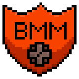
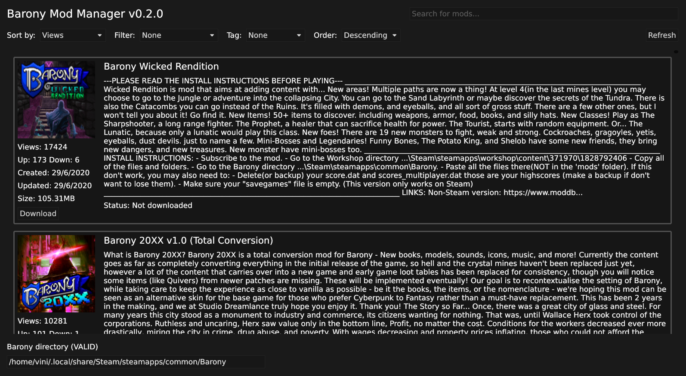

  
  <h1 align="center">Barony Mod Manager</h1>

# Table of contents

- [Intro](#intro)
- [Getting Started](#getting-started)
  * [Building the Project](#building-the-project)
  * [Using the Mod Manager](#using-the-mod-manager)
  * [Activating Mods](#activating-mods)
- [TODO](#todo)

# Intro
This project is a work-in-progress cross-platform mod manager for the game
[Barony](https://store.steampowered.com/app/371970/Barony/). It aims to provide
a platform-agnostic interface to manage all the barony mods available through its
[Steam Workshop](https://steamcommunity.com/workshop/about/?appid=371970). So
you can easily download Barony mods, whether you are using a [custom Barony build](https://github.com/TurningWheel/Barony)
or the Steam, Epic Games, or GOG version of the game.

# Getting Started

## Building the Project
Currently there are not built releases, so if one want to build the project he
needs:
- On Windows, download the project and the rust compiler + cargo, then just
    running `cargo build --release` should build the project.
- On Linux using Nix, just clone the project and enter the development
    environment with `nix develop`. There are not packages defined inside the
    flake yet.

## Using the Mod Manager
After building you can use the search input and the filters to match exactly what
you are looking for and install/uninstall mods using the respective buttons in
their cards. Have a great time modding Barony!

## Activating Mods
Since the game does an awesome job at loading/unloading mods at runtime, I don't
think trying to mimic this functionality here is a great deal. So in order to
activate or activate the mods you've downloaded:
- Inside Barony, click `Custom Content`
- Click `local mods` and it will show up all the mods that you've downloaded
    through the mod manager
- `load/unload` the mods that you want to
- Click `start modded game` and be happy!

# TODO:
- Handle mods which depends on other mods
- A simple table-like mod view
- Modpack support
- Folder picker widget for choosing the barony folder
- Mod download progress bar
- Wait until the `iced` library improve its `Scrollable` widget, which hopefully
  will make the application use much less resources.
