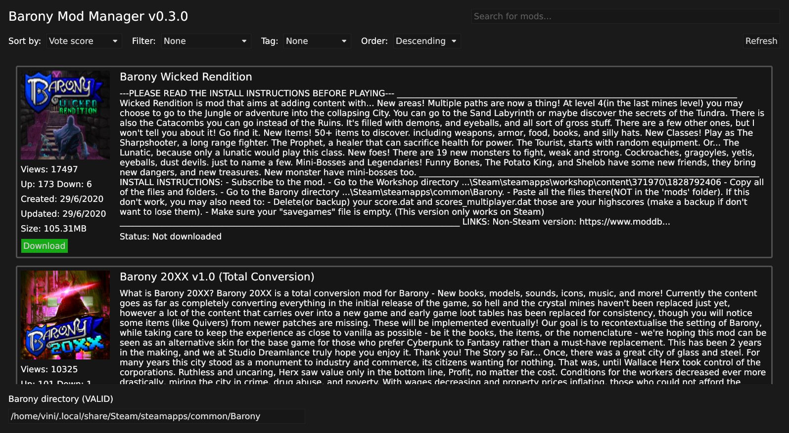

  
  <h1 align="center">Barony Mod Manager</h1>

# Table of contents

- [Intro](#intro)
- [Getting Started](#getting-started)
  - [Downloading](#downloading)
  - [Using the Mod Manager](#using-the-mod-manager)
  - [Activating Mods](#activating-mods)
  - [Building the Project from Source](#building-the-project-from-source)
- [Contributing](#contributing)
- [TODO](#todo)

# Intro
This project is a work-in-progress cross-platform mod manager for the game
[Barony](https://store.steampowered.com/app/371970/Barony/). It aims to provide
a platform-agnostic interface to manage all the barony mods available in its
[Steam Workshop page](https://steamcommunity.com/workshop/about/?appid=371970). So
you can easily download Barony mods, whether you are using a [custom Barony build](https://github.com/TurningWheel/Barony)
or the Steam, Epic Games, or GOG version of the game.

# Getting Started

## Downloading
The latest project release can be found [here](https://github.com/arcticlimer/barony-mod-manager/releases/). Go at the release and select the appropriate version for your system.
- For Windows: `barony-mod-manager.exe`
- For GNU/Linux: `barony-mod-manager_amd64`
- For MacOS: `barony-mod-manager_darwin`

## Using the Mod Manager
You can use the search input and the filters to match exactly what you are
looking for and download/remove mods using the respective buttons in their
cards. Have a great time modding Barony!

## Activating Mods
Since the game does a great job at loading/unloading mods at runtime, I don't
think trying to mimic this functionality here is a great deal. So in order to
activate or activate the mods you've downloaded:
- Inside Barony, click `Custom Content`
- Click `local mods` and it will show up all the mods that you've downloaded
    through the mod manager
- `load/unload` the mods that you want to
- Click `start modded game` and be happy!

## Building the Project from Source
In order to build the project, one needs:

### On Windows
- [Install Rust](https://doc.rust-lang.org/book/ch01-01-installation.html#installing-rustup-on-windows)
- Download the project, enter the `barony-mod-manager` folder and run `cargo
    build --release`.

### On Linux (Nix)
On Linux using [Nix](https://nixos.org/download.html), just clone the project
and enter the development environment with `nix develop`. Then you can just run
`cargo build --release` and use the software. There are no packages defined
inside the flake yet.

# Contributing
If you find any problems or bugs when using the program, feel free to report
them in the `Issues` section or even send a `Pull Request` fixing it.

# TODO
- Handle mods which depends on other mods
- A simple table-like mod view
- Modpack support
- Folder picker widget for choosing the barony folder
- Mod download progress bar
- Wait until the `iced` library improve its `Scrollable` widget, which hopefully
  will make the application use much less resources.
